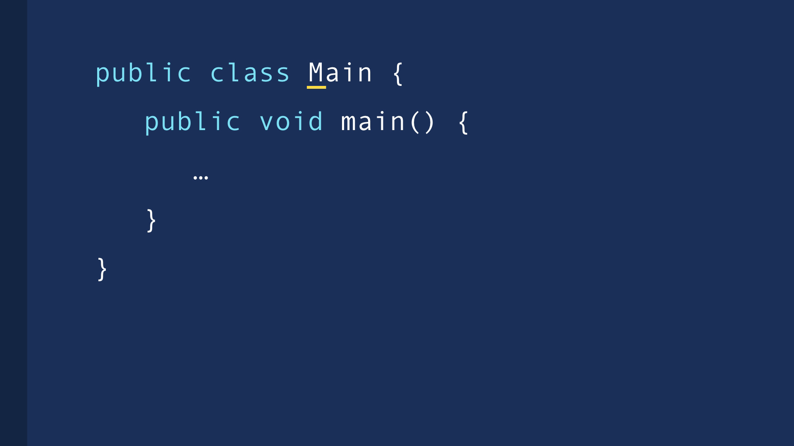

# Anatomy of a Java Program

## Overview

- In this Java tutorial, we’re going to look at the **anatomy** of Java programs.
- You’ll learn how **functions** (the smallest building blocks) work, how they belong to **classes**, and why every Java program needs a **main** function.

## Functions

- **What are functions?**
  - Functions are blocks of code that perform specific tasks.
  - As a metaphor, they’re like the buttons on your TV remote: each button (function) has its own job.
- **Examples of function tasks:**
  - Sending emails to people.
  - Converting weight from pounds to kilograms.
  - Validating user input.

## Defining a Function in Java

- **Return type:**
  - Some functions return a value (like a number or date/time), while others return nothing (using the keyword `void`).
- **Function name:**
  - Should be descriptive (e.g., `sendEmail`) to clearly communicate its purpose.
- **Parameters:**
  - Placed inside parentheses. Used to pass values to the function (e.g., email receiver, subject, or content).
- **Function body:**
  - Written inside curly braces `{ }` immediately following the definition line (Java convention places the opening brace on the same line).

## The `main` Function

- **Entry point:**
  - Every Java program must include at least one function named `main`.
  - When you run a Java application, `main` is called first, and its code executes.
- **Usage:**
  - This is where the program truly begins—no `main`, no starting point.

## Classes

- **Purpose:**
  - Functions (methods) can’t stand alone; they must reside within a **class**.
  - Classes act like containers that organize related functions.
- **Analogy:**
  - Similar to how a supermarket has separate sections for fruits, vegetables, and cleaning products, each class groups together related methods.
- **At least one class needed:**
  - Every Java program requires at least one class containing `main`.
  - This class is often named `Main` (with a capital “M”).
- **Defining a class:**
  - Use the `class` keyword and give it a name (in **PascalCase**).
  - Place methods (functions) within the class’s curly braces. When a function is inside a class, we call it a **method**.

## Access Modifiers

- **Overview:**
  - Java requires an access modifier (e.g., `public` or `private`) for its classes and methods.
  - This determines whether other parts of the program can use or “see” them.
- **Common usage:**
  - `public` is frequently used, especially when starting out, to allow broad access.

## Naming Conventions

- **Classes:**
  - Use **PascalCase** (e.g., `Main`, `MyFirstProgram`).
- **Methods:**
  - Use **camelCase** (e.g., `sendEmail`, `convertWeight`).
  - `main` starts with a lowercase letter, aligning with this convention.

## Conclusion

- A minimal Java program has a **Main** class with a **main** method.
- Classes are your containers for **methods**, and **functions** are blocks of code that accomplish specific tasks.
- With this understanding of the program’s structure, you’re ready to create a new Java project and see all these building blocks in action.
