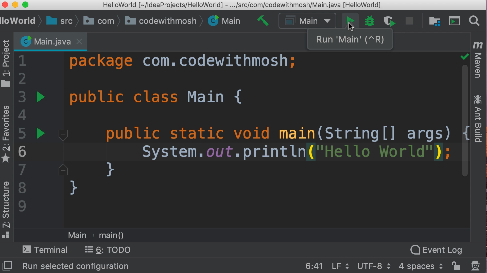

# Your First Java Program

## Overview

- This lesson teaches you how to **create and run your first Java program** using **IntelliJ IDEA**.
- You’ll learn about setting up a project, understanding packages, writing the `main` method, and printing output to the terminal.

## Creating a New Project in IntelliJ IDEA

- **Steps to create a new project:**

  - Open **IntelliJ IDEA** and click **Create New Project**.
  - On the left panel, select **Java**.
  - Ensure the **Project SDK** is set (e.g., `JDK 12`).
  - Click **Next**.
  - Choose **Create Project from Template** → select **Command Line Application**.
  - Click **Next**.

- **Why Command Line?**

  - It’s simpler than GUI or mobile apps — great for learning core Java concepts first.

- **Project setup:**
  - Name the project: `HelloWorld`.
  - Base package: typically your domain in reverse (e.g., `com.codewithmosh`).
    - Doesn’t require a real domain.
    - Helps organize classes.
    - Acts as a **namespace** for your program.

## Understanding the Project Structure

- IntelliJ displays:
  - Project panel on the left
  - Code editor on the right
- Inside the `src` folder:

  - You’ll find the package (e.g., `com.codewithmosh`)
  - And the `Main.java` file

- **Java file naming:**
  - All Java source files must end with `.java`
  - Example: `Main.java`

## Anatomy of the First Java File

- **Top line:**

  - `package com.codewithmosh;` – indicates which package this class belongs to
  - Ends with a semicolon (`;`), like most Java statements

- **Main class structure:**

```java
public class Main {
    public static void main(String[] args) {
        // Code goes here
    }
}
```

- **Keywords explained:**
  - `public`: Accessible from outside the class
  - `static`: Belongs to the class (not an object instance)
  - `void`: No return value
  - `main`: The entry point of the program
  - `String[] args`: Parameter used to pass arguments from the command line

## Writing and Understanding the Code

- **Printing output to the terminal:**

```java
System.out.println("Hello World");
```

- **Breakdown:**
  - `System` is a built-in Java class in the `java.lang` package
  - `out` is a **field** (object) of type `PrintStream`
  - `println` is a **method** used to print a line of text
  - `"Hello World"` is a **string**, wrapped in double quotes

## Comments

- **Single-line comments:**
  - Start with `//`
  - Used to explain code — not executed

## Running the Program

- Use the green play icon or **shortcut (Mac: `Control + R`)** to run the program
- IntelliJ will:
  - Compile and build the application
  - Output: `Hello World` in the terminal window



## Conclusion

- You’ve just written and executed your **first Java program**!
- You’ve learned how to:
  - Set up a project in IntelliJ
  - Understand packages and the project structure
  - Write the `main` method and print to the console
- Up next: Understanding how Java code is **executed under the hood**.
